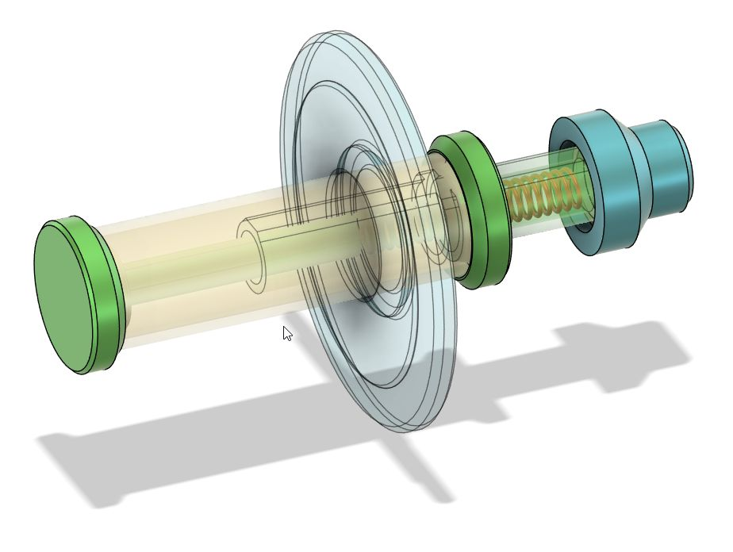

# Experiments with thermal printers

## Goal
The goal with this repository is to be able to print different types of thermal label stickers in the following formats:

* 40mm X 30mm Square
* 40mm X 20mm Square
* 40mm X 20mm Round

## Useful Links
* [Medium, Osama - ESC/POS Commands](https://medium.com/@osamainayat4999/esc-pos-commands-f0ab0c3b22cc)

* [escpos.readthedocs -Paper Movement Commands](https://escpos.readthedocs.io/en/latest/paper_movement.html)

* [CodingwithLewis youtube - I Fixed My ADHD with a Receipt Printer](https://www.youtube.com/watch?v=xg45b8UXoZI)  

* [CodingwithLewis github - printing agent](https://github.com/CodingWithLewis/ReceiptPrinterAgent/) 

* [TM-T20III Technical Reference](https://files.support.epson.com/pdf/pos/bulk/tm-t20iii_trg_en_reva.pdf)

* [escpos database - config examples](https://github.com/receipt-print-hq/escpos-printer-db/blob/master/data/profile/ITPP047.yml)

## Hardware
### Printers
The printers I will be working on are: 
* Epson TM-T20III
* XP-T80Q (Cheap Printer from Aliexpress)

### Operating System
Windows 11

## Usb
If you want to use Usb in windows, open computer management - Universial Serial 
Bus Controllers. Find correct printer and right click properties. Then under 
Hardware Ids you can find the idVendor and idProduct. They look like this: 
USB\VID_1FC9&PID_2016&REV_0200

idVendor = 0x1FC9

idProduct = 0x2016

### Notes
The XP-T80Q was a little harder to set up because of driver availability, but once I got it working the print quality was exactly the same between the 2 printers.

### 3d print
Since the smaller width labels don't fit the 80mm printers, I made a universal spring loaded fixture to clamp them to the left wall of the printers. 

[Step file](thermal_printer_spring.step)

Description of the parts:
I used 2 materials. PETG for the rigid parts
TPU for the non-rigid.
* Body1 - I cut a PVC-pipe to 54mm and used that. But you could print this in PLA/PETG too.
* Body2 - Just a model of the spring. It should be around 30mm and fit in the 7mm hole. I use a 5.5mm Ø spring that is 30mm long.
* Body3 - Spring housing. PLA/PETG
* Body4 - Inner cap with spring guidance. PLA/PETG
* Body5 - Inner cap - PLA/PETG
* Body6 - Outer cap - PLA/PETG
* Body7 - Sliding Ring - TPU
* Body8 - Extension Cap - TPU

## images
The fonts out of the box are pretty bad for these printers. Therefore it's best to create small images with custom fonts and art of our choosing as all printers can print these. This is especially cruial when printing stickers as it gives us fine control of both height and width by adjusting the image size. DPI is 203 which means that a 40mm x 30mm sticker needs an image of 320px x 240px. Then we also adjust for the space between the stickers (if any). A gap of 6mm gives us a 40mm x 36mm image which in 203dpi translates to 320px x 288px
